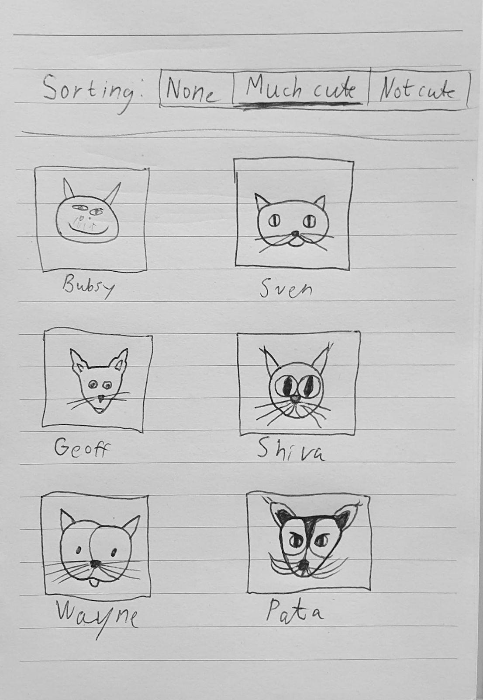

# Work test for Delorean AB
Made by Thomas Granbohm

## 🚀 Setup  
If you have Docker, run this command in this directory:   
```
docker-compose up -d
```  
The app will then run at http://localhost/.   
  
If you do not want to run this app with Docker, you can start both.   
In the backend directory, run: `go run webserver.go`  
In the frontend directory, run: `yarn start` or `npm start`  


## 🚧 Instructions
You have been assigned a task from Cats IncorpurrateTM.  
You have been supplied with the following instructions.  
Below is a UI mockup of an interface.  

### Step 1  
You are given images of cats (/images/*), and data of cats (catdata.json).  
 - Using JavaScript, build a page displaying all the cats with their respective images and names from the cat data. Following the UI mockup.
 - Make the list of cats sortable with at least
 	- “no sorting” (meaning the order they appear in the data)
 	- Level of cuteness ascending
 	- Level of cuteness descending
 - Use whatever JavaScript technique you are comfortable with, except jQuery.
 - The UI mockup is the MVP. If you want to add something extra, feel free, as it will only please Cats IncorpurrateTM.

### Step 2  
Management has a specific request for backend technology used. Don’t worry, this is
simpler than it initially looks.

 - The catdata.json file you have been supplied with must now be served via a webserver written in Golang.
 - You can find the language at ​ https://golang.org/
 - Modify your code from step 1 to instead read the json from this webserver.
 - Keep the json file intact, the webserver must read the file from disk.
 - Test that you can load your page from step 1 the same way using this new backend to serve the data.  


### UI Markup
